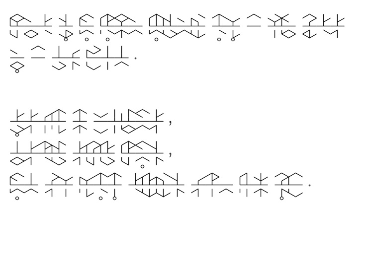

# Tunic Translator
A tool for translating English into Tunic language, which is a runic language in the video game Tunic.

Tunic Translator is now available on my [github.io](https://norgannon1028.github.io/), check this out!!

## Install

First, you need to install all the dependencies provided by requirements.txt, simply run

```
pip install -r ./requirements.txt
```

Since Tunic Language is designed from English and English phonetic alphabet, you also need to install Flite(lex_lookup) to get Epitran work. We recommend that you obtain the source from [Flite homepage](https://github.com/festvox/flite), and follow the instructions below:
```
git clone https://github.com/festvox/flite.git
cd flite/

./configure && make
sudo make install
cd testsuite
make lex_lookup
sudo cp lex_lookup /usr/local/bin
```
When installing on MacOS and other systems that use a BSD version of cp, some modification to a Makefile must be made in order to install flite-2.0.5 (between steps 3 and 4). Edit main/Makefile and change both instances of cp -pd to cp -pR. Then resume the steps above at step 4.

## Usage

Run `python translator.py -h` to check the usage of the Tunic Translator.

```
usage: translator.py [-h] [-i <file>] [-o <file>] [-l <int>] [-c <int>]

optional arguments:
  -h, --help            show this help message and exit
  -i <file>, --input <file>
                        read the input from <file>, where input should be English in plain text. (Default: input.txt)
  -o <file>, --output <file>
                        place the output into <file>, where ouput should be either jpg or png. (Default: output.jpg)
  -l <int>, --line <int>
                        set the number of lines in the canvas, affect the canvas height. (Default: 8)
  -c <int>, --char <int>
                        set the number of characters per line, affect the canvas width. (Default: 25)
```

Prepare the input file you want to translate from. Remember that only `English words` and `,.?!` are supported. The translator takes  `input.txt` by default. Let's take a look:

```
Tunic is an action adventure about a tiny fox in a big world. 

Explore the wilderness, 
discover spooky ruins, 
and fight terrible creatures from long ago!
```

Simply run

```
python translator.py
```

Then the translator generates the Tunic language translation and stores it as an image.  The translator gives`output.jpg` by default. It looks like this:



## Reference

Huge credit goes to Reddit user [u/oposdeo](https://www.reddit.com/user/oposdeo/), who managed to decode the Tunic language, and the language reference sheet was posted [here](https://www.reddit.com/r/TunicGame/comments/tgc056/tunic_language_reference_sheet_big_spoiler/).

This translator was made possible with the [Epitran](https://github.com/dmort27/epitran), which is a python library for transliterating orthographic text as IPA (International Phonetic Alphabet).

Also thanks for the Tunic language [video tutorial](https://www.bilibili.com/video/BV1n541117Pi?share_source=copy_web) given by [旭日之记忆](https://space.bilibili.com/12994).